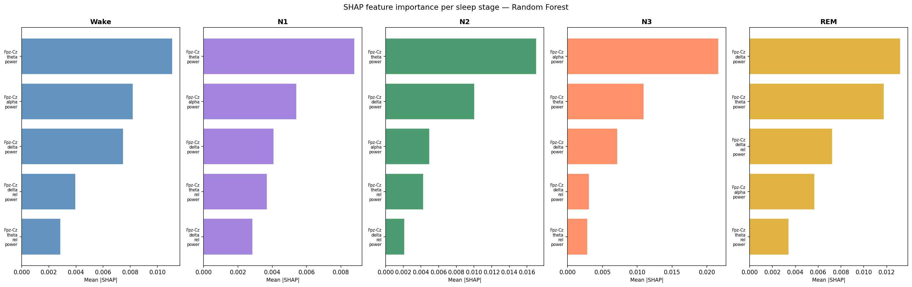
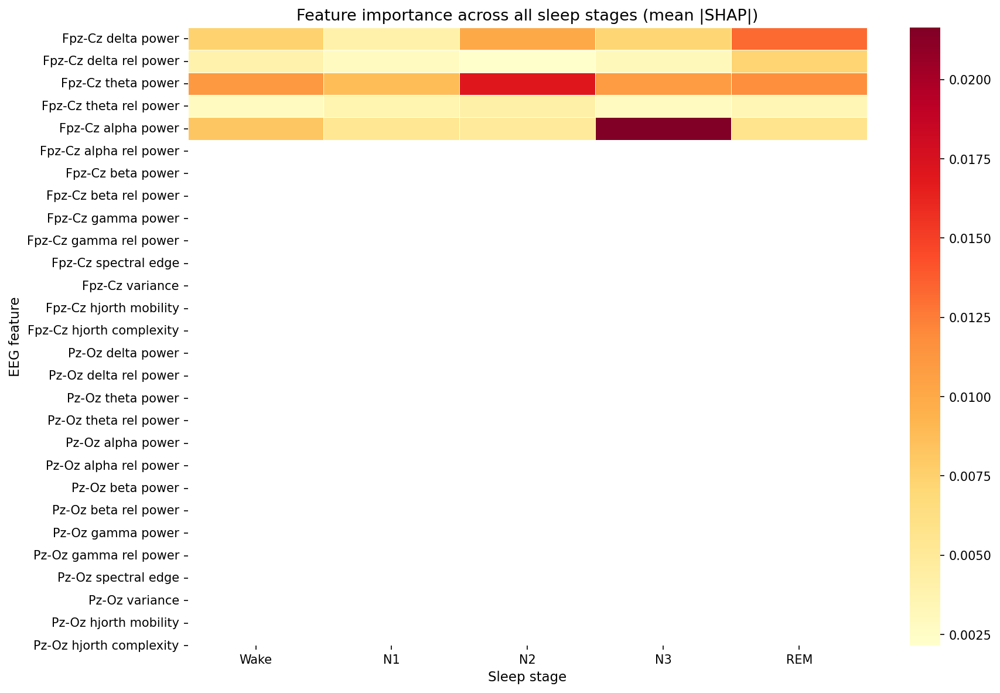
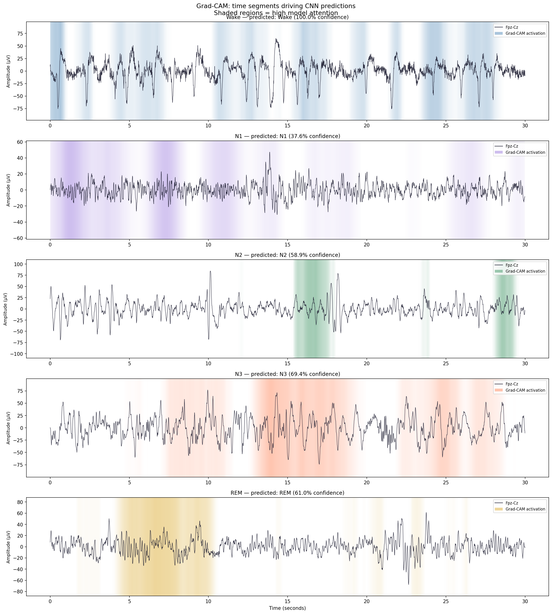
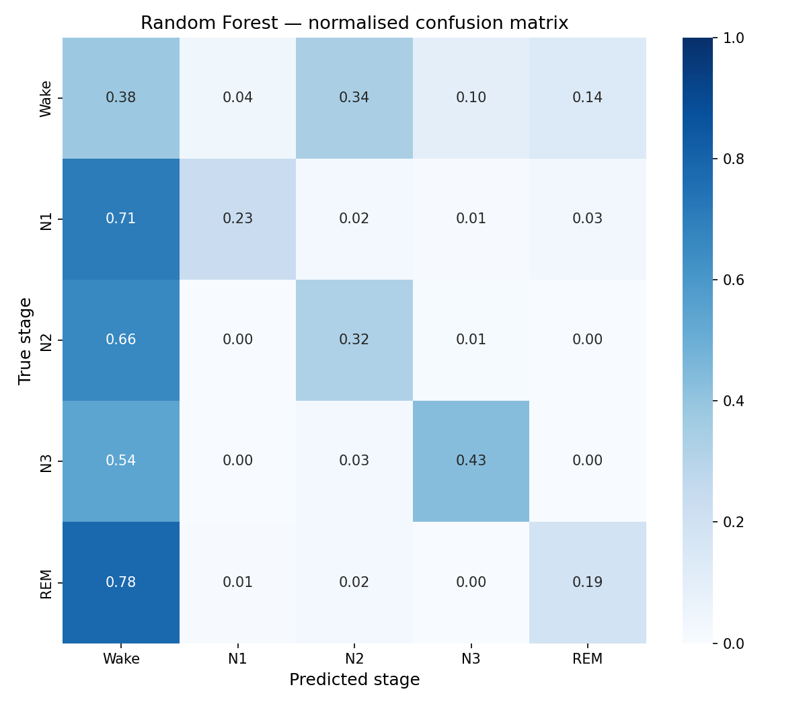
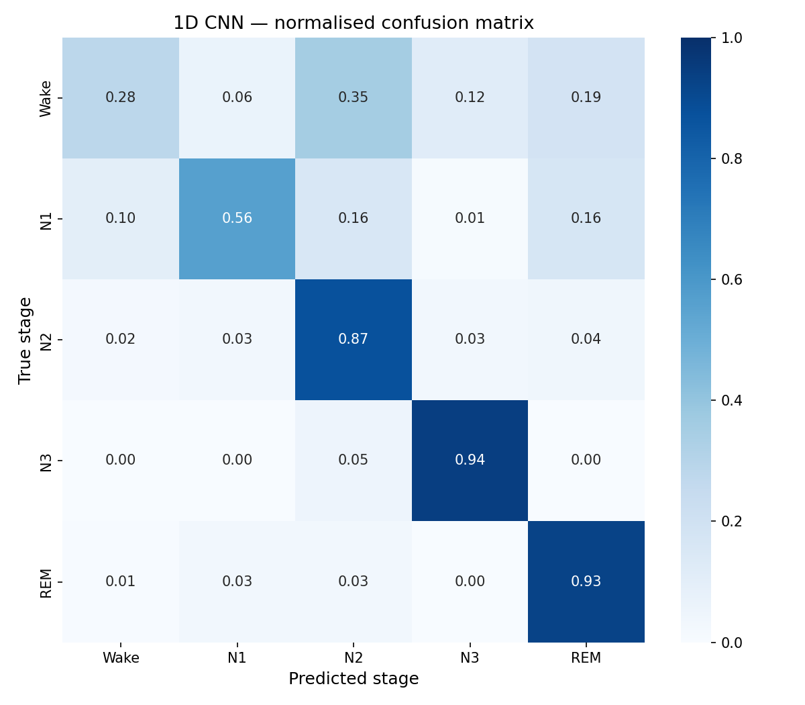

# EEG Sleep Stage Classification

Automated sleep stage classification from raw EEG signals using deep learning and interpretable AI. Built on the Sleep-EDF Expanded dataset using MNE-Python, a 1D CNN, and SHAP and Grad-CAM interpretability layers.

---

## Clinical Motivation

Sleep difficulties are common in children with neurodevelopmental conditions including autism, ADHD, epilepsy, and Down syndrome, and can have profound effects on cognition, behaviour, and family life. Measuring sleep objectively requires EEG analysis, but manual scoring by clinicians is slow, expensive, and not scalable.

This project develops and evaluates a computational pipeline that automates sleep stage classification from EEG recordings a direct methodological contribution toward characterising sleep in neurodevelopmental populations.

The work uses publicly available adult recordings (Sleep-EDF) as a foundation. The preprocessing, modelling, and interpretability methods transfer directly to paediatric EEG, and the pipeline is designed with that clinical extension in mind.

---

## Sleep Staging Background

Sleep is scored in 30-second windows following the AASM standard into five stages:

| Stage | Description | Key EEG Pattern |
|-------|-------------|-----------------|
| Wake  | Wakefulness | High-frequency, low-amplitude mixed activity |
| N1    | Light sleep | Theta waves (4–8 Hz), slow rolling eye movements |
| N2    | Intermediate sleep | Sleep spindles (12–15 Hz), K-complexes |
| N3    | Deep sleep | Delta waves (0.5–4 Hz), high amplitude slow oscillations |
| REM   | Dreaming | Low-amplitude mixed frequency, paradoxical sleep |

The dataset uses the older Rechtschaffen and Kales (1968) scoring system which splits N3 into Stages 3 and 4. These are merged in preprocessing to match the modern AASM standard.

---

## Dataset

**Sleep-EDF Expanded** (PhysioNet, open access)

- 13 subjects from the Sleep Cassette study
- Whole-night polysomnographic recordings at 100 Hz
- Two EEG channels: Fpz-Cz and Pz-Oz
- Expert-annotated hypnograms for every 30-second epoch
- 22,683 epochs after preprocessing and artefact rejection

The recordings are approximately 20 hours each, including daytime wakefulness. The pipeline automatically detects the sleep window from hypnogram annotations and trims each recording accordingly — ensuring the model trains on clinically relevant data rather than daytime activity.

---

## Project Structure

```
eeg-sleep-staging/
│
├── src/
│   ├── preprocess.py     # EEG loading, trimming, filtering, epoching
│   ├── features.py       # Hand-crafted spectral and complexity features
│   ├── model.py          # 1D CNN architecture definition
│   ├── train.py          # Training pipeline for RF baseline and CNN
│   └── evaluate.py       # SHAP and Grad-CAM interpretability
│
├── notebooks/            # Results visualisation
├── results/              # Plots and evaluation outputs
├── models/               # Saved model weights (not tracked by git)
├── data/                 # Raw EEG files (not tracked by git)
└── requirements.txt
```

---

## Pipeline

### Phase 1 — Preprocessing

Each recording is processed through a four-stage pipeline:

1. **Load** raw EEG with MNE-Python, keeping only the two EEG channels
2. **Trim** to the sleep window — detected automatically from hypnogram annotations, with a 30-minute buffer either side. This removes several hours of daytime Wake data that would otherwise dominate the class distribution
3. **Filter** with a 0.5–40 Hz bandpass FIR filter — preserving all biologically meaningful frequency bands while removing slow drift and high-frequency noise
4. **Epoch** into 30-second windows following AASM convention (3,000 timepoints at 100 Hz)
5. **Reject** artefact epochs exceeding 150 µV amplitude threshold

Artefact rejection rates ranged from 0.0% to 13.1% across subjects, with a mean of 1.5%.

### Phase 2 — Feature Extraction and Baseline

Hand-crafted features are extracted per epoch for a Random Forest baseline:

- Absolute and relative band power in delta, theta, alpha, beta, and gamma bands
- Spectral edge frequency (95th percentile power frequency)
- Signal variance
- Hjorth mobility and complexity

This produces a 28-feature vector per epoch. The baseline establishes a performance benchmark and enables SHAP interpretability.

### Phase 3 — 1D CNN

The CNN operates directly on raw EEG signals, learning its own feature detectors from waveform morphology.

```
Input: (3000, 2) — 30 seconds at 100 Hz, 2 EEG channels

Conv1D (64 filters, kernel 50) → BatchNorm → ReLU → MaxPool (÷4)
Conv1D (128 filters, kernel 25) → BatchNorm → ReLU → MaxPool (÷4)
Conv1D (256 filters, kernel 10) → BatchNorm → ReLU
GlobalAveragePooling1D
Dense (128) → Dropout (0.5)
Dense (64) → Dropout (0.3)
Dense (5) → Softmax

Output: (5,) — probability per sleep stage
```

Total parameters: 582,597

Key design decisions:
- Kernel size 50 in block 1 spans 0.5 seconds — long enough to detect a full sleep spindle
- GlobalAveragePooling rather than Flatten prevents overfitting on small datasets
- Class weights compensate for the imbalanced sleep stage distribution
- EarlyStopping restores best weights automatically

### Phase 4 — Interpretability

**SHAP (SHapley Additive exPlanations)** is applied to the Random Forest to identify which frequency-domain features drive each sleep stage classification.

**Grad-CAM** is applied to the 1D CNN to highlight which time segments within each 30-second epoch drove the classification decision — visualised as a shaded overlay on the raw EEG signal.

---

## Results

### Model Comparison

| Metric | Random Forest | 1D CNN |
|--------|--------------|--------|
| Balanced accuracy | 0.312 | **0.718** |
| Cohen's Kappa | -0.024 | **0.430** |
| Overall accuracy | 0.34 | 0.56 |

Cohen's Kappa of 0.430 indicates moderate agreement. Published benchmarks on Sleep-EDF with similar subject counts typically report kappa between 0.60–0.75 — the gap reflects the 13-subject training set and motivates further scaling.

### Per-Stage Performance (CNN, test set)

| Stage | Precision | Recall | F1 |
|-------|-----------|--------|----|
| Wake  | 0.94 | 0.28 | 0.43 |
| N1    | 0.33 | 0.56 | 0.41 |
| N2    | 0.53 | 0.87 | 0.66 |
| N3    | 0.50 | 0.94 | 0.65 |
| REM   | 0.44 | 0.93 | 0.60 |

### Key Findings

**1. CNNs generalise across subjects, Random Forests do not**

The Random Forest achieved 0.396 balanced accuracy on 3 subjects but degraded to 0.312 on 13. The CNN improved from 0.711 to 0.718. Spectral features do not generalise across individuals because absolute EEG amplitude varies between people. The CNN learns relative waveform patterns that are more subject-invariant.

**2. The model independently discovered sleep spindle locations**

Grad-CAM analysis of N2 epochs shows the model's attention concentrating at brief, localised bursts within the 30-second window — the same time segments where sleep spindles appear in the raw signal. The model was never told what a spindle looks like; it discovered these clinically meaningful structures from labelled data alone.

**3. Alpha power absence defines N3**

SHAP analysis shows Fpz-Cz alpha power is the single most important feature for N3 classification — not delta power as might be expected. The model learned that very low alpha is the most discriminative signal for deep sleep, which is neuroscientifically valid and consistent with the literature.

**4. REM improved most from RF to CNN**

REM recall went from 0.19 (RF) to 0.93 (CNN). REM and Wake have nearly identical frequency spectra, making band power features uninformative. The CNN learned morphological differences in waveform shape that hand-crafted features cannot capture.

**5. Wake recall remains the primary limitation**

Wake precision is 0.94 but recall is only 0.28 — the model is conservative about predicting Wake within the sleep window. This is a well-documented challenge in sleep staging with imbalanced datasets and is the primary motivation for the LSTM extension described below.

---

## Interpretability Outputs

### SHAP Feature Importance



Per-stage bar charts showing which EEG features most influenced the Random Forest's decisions. Theta power dominates Wake, N1, and N2. Alpha power absence is the defining signal for N3.



Feature importance heatmap across all five stages. The concentration of importance in the top five features — all from the Fpz-Cz frontal channel — reflects the frontal lobe's dominant role in sleep-wake regulation.

### Grad-CAM Signal Attention



Each panel shows a correctly classified epoch with the CNN's attention overlaid as a coloured shading. Brighter shading indicates time segments that most strongly drove the prediction.

Notable patterns:
- **Wake**: Broad, distributed attention across the entire epoch reflecting globally active broadband activity
- **N2**: Attention concentrated at 2–3 localised bursts corresponding to sleep spindle events
- **N3**: Attention tracks the peaks of slow delta wave oscillations
- **REM**: Localised attention at subtle morphological features distinguishing it from Wake

---

## Confusion Matrices

| Random Forest | 1D CNN |
|:---:|:---:|
|  |  |

The RF confuses most stages with Wake. The CNN resolves N2, N3, and REM well — the remaining challenge is distinguishing Wake from light sleep within the sleep window, where the two are genuinely similar.

---

## Limitations and Future Work

**Dataset limitations**

Sleep-EDF contains healthy adult subjects. The target clinical application involves children with neurodevelopmental conditions, whose EEG morphology and sleep architecture differ substantially — including more N3 in early childhood, atypical spindle characteristics, and higher rates of fragmented sleep. Transfer learning from adult to paediatric recordings is a research question rather than an assumption.

**Temporal context**

The current CNN classifies each 30-second epoch in isolation. Sleep stage transitions follow biological rules — N1 almost always precedes N2, deep N3 typically occurs in the first half of the night, REM periods lengthen across the night. A CNN+LSTM hybrid that models the sequence of stages across the night would resolve much of the Wake/N1 confusion and improve overall accuracy.

**Scale**

13 subjects is sufficient to demonstrate the methodology but insufficient for robust cross-subject generalisation. The full Sleep-EDF Cassette subset contains 153 recordings. Training on all 153 would be the natural next step before attempting transfer to paediatric data.

**Causal analysis**

The current pipeline characterises what sleep looks like in EEG. The deeper clinical question is what causes abnormal sleep patterns in neurodevelopmental conditions and what effects they have on cognition and behaviour — a causal inference problem that goes beyond classification.

---

## Reproducing the Results

```bash
# clone the repository
git clone https://github.com/danielakbank/eeg-sleep-staging.git
cd eeg-sleep-staging

# create and activate virtual environment
python -m venv venv
venv\Scripts\activate        # Windows
source venv/bin/activate     # Mac/Linux

# install dependencies
pip install -r requirements.txt

# download data (3 subjects to start)
python -c "
import mne
mne.datasets.sleep_physionet.age.fetch_data(
    subjects=[0,1,2], recording=[1], path='data/'
)
"

# run full pipeline
python src/preprocess.py
python src/features.py
python src/train.py --model both
python src/evaluate.py
```

---

## Tech Stack

| Component | Tools |
|-----------|-------|
| EEG processing | MNE-Python, NumPy, SciPy |
| Feature extraction | SciPy (Welch PSD), custom Hjorth implementation |
| Baseline model | Scikit-learn RandomForestClassifier |
| Deep learning | TensorFlow / Keras |
| Interpretability | SHAP, Grad-CAM (custom 1D implementation) |
| Visualisation | Matplotlib, Seaborn |

---

## References

Kemp B et al. Analysis of a sleep-dependent neuronal feedback loop: the slow-wave microcontinuity of the EEG. *IEEE-BME* 47(9):1185–1194 (2000)

Rechtschaffen A, Kales A. A manual of standardized terminology, techniques and scoring systems for sleep stages of human subjects. UCLA Brain Information Service (1968)

Berry RB et al. The AASM Manual for the Scoring of Sleep and Associated Events. American Academy of Sleep Medicine (2012)

Goldberger AL et al. PhysioBank, PhysioToolkit, and PhysioNet. *Circulation* 101(23):e215–e220 (2000)
